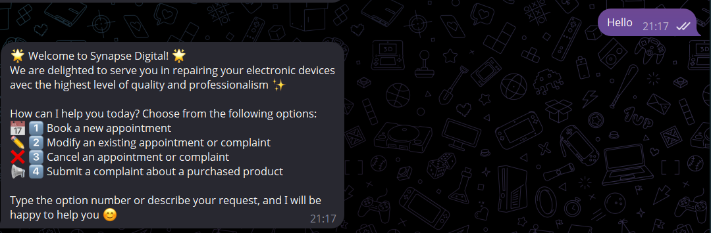
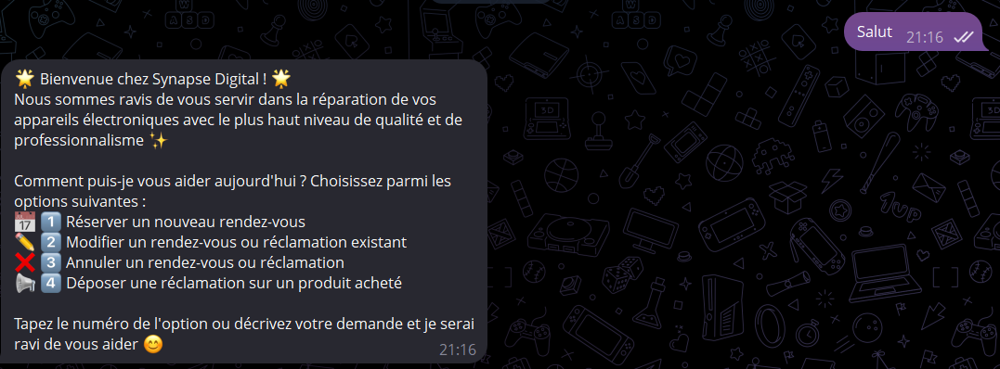
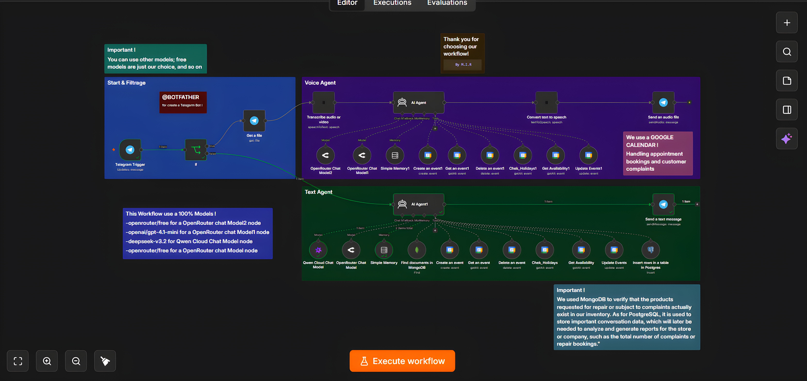

# 🔧 Synapse Digital — AI Voice/Text Secretary

A trilingual (Arabic / French / English) AI receptionist for an electronics repair shop, built entirely as an **n8n workflow**. It runs on Telegram, understands both **voice notes and text**, and autonomously handles appointment booking, appointment modification/cancellation, and product complaints — with real backend checks (stock, availability, holidays, business hours) before anything is confirmed.

No custom backend server, no separate database admin panel to build: the whole business logic — validation rules, pricing, scheduling constraints, database writes — lives inside a single importable n8n workflow.

## 📑 Table of contents

- [Demo](#-demo)
- [Features](#-features)
- [Architecture](#-architecture)
- [Tech stack](#️-tech-stack)
- [Setup](#-setup)
- [Customization](#-customization)
- [Security & Privacy](#-security--privacy)
- [License](#-license)

## 🎬 Demo

The same bot, same logic, three languages — it detects the customer's language automatically and never mixes languages mid-sentence:

| English | Français | العربية |
|---|---|---|
|  |  |  |

## ✨ Features

**Conversation & language**
- Detects and replies in Arabic, French or English automatically, switching instantly if the customer switches language mid-conversation.
- Handles both **typed messages** and **Telegram voice notes**: voice is transcribed to text, processed, then the reply is converted back to speech and sent as an audio message; text messages get a text reply.
- Loosely-tolerant data validation for names/phone numbers/IDs — built to survive messy speech-to-text output (spaces, dots, numbers written as words) instead of rejecting valid input over formatting.
- Strict scope-lock: refuses off-topic requests, general-knowledge questions, and prompt-injection/jailbreak attempts ("ignore your instructions", "act as...", etc.) — it only ever behaves as the shop's secretary.

**Booking flow**
- Collects full name, phone number, national ID, device brand/model and the issue, one question at a time.
- Configurable ID/phone format — defaults to ~8-digit numbers starting with specific digits (Tunisian format), editable in a few lines for any country (see [Customization](#-customization)).
- Cross-checks the declared device/issue against a built-in accepted-repairs price list (phones, iPhones, tablets, laptops, MacBooks, desktops, GPUs, monitors, PS5s, controllers…) and instantly quotes a price range.
- Reads back a full confirmation summary (name, phone, ID, device, issue, price, date, time) and waits for explicit "yes" before saving anything.
- On confirmation, generates a secret `SYNP#####` booking code the customer must present with their ID card on arrival — any mismatch is grounds for automatic cancellation.

**Complaint flow**
- Collects the same identity fields, then the product name, issue type and a free-text description.
- Before continuing, silently queries a **MongoDB** `products` collection to confirm the product was genuinely sold by the shop — if it isn't found, the flow stops and the customer is asked to double-check the name or bring their receipt.
- On confirmation, generates a secret `REC-######` complaint code (with an apology for the inconvenience), to be presented with the purchase receipt on arrival.

**Real scheduling logic (not just an LLM guess)**
Before any appointment is created or moved, the workflow silently runs, in order:
1. **Day check** — rejects Sundays (weekly closing day).
2. **Static holiday list** — a fixed set of national holiday dates, easy to edit.
3. **Live holiday check** — queries a Google Calendar holiday feed for the specific date.
4. **Business hours check** — Mon–Sat 08:00–18:00, Friday until 16:30.
5. **Availability check** — confirms the exact slot isn't already booked.

If any check fails, the customer is told why and given a list of available alternative times — the event is only written to **Google Calendar** once every check passes.

**Data & reporting**
- Appointments and complaints are both logged as Google Calendar events (for the day-to-day operational view).
- Complaints are additionally inserted into a **PostgreSQL** `reclamations` table, intended for later reporting/analytics (e.g. total complaints or bookings over time).

## 🧱 Architecture

This is the actual n8n canvas — three coordinated blocks (entry/routing, a voice-capable agent branch, and a text agent branch) sharing the same tools and business rules:

- **Start & Filtrage** — the Telegram trigger receives every incoming message and an `If` node routes it: voice notes go through speech-to-text first, text messages go straight through.
- **Voice Agent** — the AI Agent processes the (transcribed) message, calls whichever tools it needs (calendar, MongoDB, Postgres), then the reply is converted back to speech and sent as a Telegram audio file.
- **Text Agent** — a mirrored AI Agent with the exact same instructions and tools, replying as plain text for typed messages.
- Both agent branches connect to the same set of tools: `Chek_Holidays`, `Get Availability`, `Create/Get/Update/Delete an event` (Google Calendar), `Find documents in MongoDB` (stock check), and `Insert rows in a table in Postgres` (complaint logging).
- Each agent keeps its own short-term conversation memory (`Simple Memory` nodes) so it remembers earlier answers within the same conversation without re-asking.

## 🛠️ Tech stack

| Purpose | Service |
|---|---|
| Automation engine | [n8n](https://n8n.io) |
| Chat interface | Telegram Bot API |
| Speech-to-text / Text-to-speech | ElevenLabs |
| LLM | OpenRouter (e.g. `openai/gpt-4.1-mini`, `openrouter/free`) and/or Alibaba Cloud Qwen (`deepseek-v3.2`) — freely swappable |
| Appointments | Google Calendar API |
| Stock/product verification | MongoDB |
| Complaint records | PostgreSQL |

## 🚀 Setup

1. **Import the workflow**: in n8n, go to *Workflows → Import from File* and select [`workflow/Synapse_Digital_Assistant.json`](workflow/Synapse_Digital_Assistant.json).
2. **Reconnect every credential** (stripped from this export for security — see [Security & Privacy](#-security--privacy)):
   - Telegram Bot API (create a bot with [@BotFather](https://t.me/BotFather))
   - ElevenLabs API key
   - Google Calendar OAuth2 — one calendar for appointments, plus (optionally) a public holiday calendar such as `en.tn#holiday@group.v.calendar.google.com` for Tunisia, or your own country's equivalent
   - MongoDB connection — a `products` collection with at least a `product_name` field
   - PostgreSQL connection — a `reclamations` table (required columns are listed in the *Insert rows in a table in Postgres* node)
   - OpenRouter API key and/or Alibaba Cloud (Qwen) API key
3. **Set your own chat ID** in the *Send a text message* node (replace `YOUR_TELEGRAM_CHAT_ID`), or route it dynamically if the bot should serve multiple customers instead of one operator chat.
4. **Update the calendar email** in every Google Calendar node (replace `your-calendar-email@gmail.com`).
5. Activate the workflow.

## 🎛️ Customization

Everything the agent "knows" lives in plain language inside the **AI Agent** node's system prompt — no code changes needed:

- **ID/phone number format** — edit the `PHONE NUMBER & NATIONAL ID VALIDATION` section to change the expected digit count or starting digits for your country.
- **Business hours & weekly day off** — edit the date-validation block in the booking flow.
- **Fixed public holidays** — edit the static `DD-MM` date list directly, or point `Chek_Holidays` at your own country's holiday calendar.
- **Repair price list** — the `ACCEPTED REPAIRS LIST` section holds every device/issue/price range; add, remove or re-price freely.
- **Language templates** — every customer-facing message exists in `[AR]`, `[FR]` and `[EN]` variants; add a fourth language by following the same pattern.

## 🔒 Security & Privacy

This repository has been cleaned up before publishing:
- No API keys, OAuth tokens, or connection strings are included — n8n does not export raw secrets, only credential references, which have also been generalized here.
- Personal email addresses and the operator's Telegram chat ID from the original deployment have been replaced with placeholders (`your-calendar-email@gmail.com`, `YOUR_TELEGRAM_CHAT_ID`).
- The n8n instance identifier has been removed from the workflow metadata.
- You must supply your own credentials for every connected service before the workflow will run.

## 📄 License

Released under the [Apache License 2.0](LICENSE) — free to use, modify and adapt for your own business.

---

*Built with n8n — contributions and forks welcome.*
